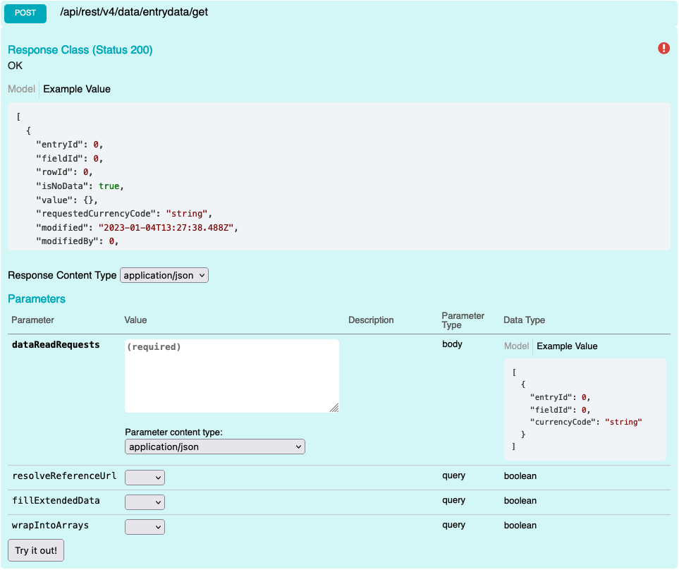

# Cells Get Data

Get Data using Cells API. You're only able to retrieve 10000 fields at a time. When working with large data sets, it's best to have a Partition function that can create large batches (example below). You can also run these batches concurrently(example below).

## Swagger


## Params

| name                | Parameter type | Data Type | Values | Description                                             |
| ------------------- | -------------- | --------- | ------ | ------------------------------------------------------- |
| resolveReferenceUrl | Query          | bool      | false  | if you want to return the URL for entry                 |
| fillExtendedData    | query          | bool      | false  | Appends modified DataTime and Modified By to entry data |
| wrapIntoArrays      | query          | bool      | true   | ensures consistency for multi-value fields              |

## Request
When requesting data, entryId and fieldId are always required. If currency field, you can optionally pass a currency value. Passing RC will return the value in the recorded currency. Passing a valid currency string will convert the stored value into the currency specified in the response.

```json
[
  {
    "entryId": 0,
    "fieldId": 0,
    "currencyCode": "string"
  }
]
```

## Request
```
POST {{host}}/api/rest/v4/data/entrydata/get HTTP/1.1
?wrapIntoArrays=true
Content-Type: application/json
Authorization: {{auth}}

[
  {
    "entryId": 2772624,
    "fieldId": 2211
  },
  {
    "entryId": 2772624,
    "fieldId": 2212
  }
]

```

**Response**
```
HTTP/1.1 200 OK
[
  {
    "entryId": 2772624,
    "fieldId": 2211,
    "isNoData": false,
    "value": {
      "id": 2772624,
      "name": "Test Interactions",
      "entryListId": 2013
    },
    "requestedCurrencyCode": "RC"
  },
  {
    "entryId": 2772624,
    "fieldId": 2212,
    "rowId": 23555389,
    "isNoData": false,
    "value": [
      {
        "id": 3043023,
        "name": "REST API Guide_20201009.docx",
        "entryListId": 2010
      }
    ],
    "requestedCurrencyCode": "RC"
  }
]
```
**Extended Request**
```
POST {{host}}/api/rest/v4/data/entrydata/get HTTP/1.1
  ?wrapIntoArrays=true
  &resolveReferenceUrl=true
  &fillExtendedData=true
Content-Type: application/json
Authorization: {{auth}}

[
  {
    "entryId": 2772624,
    "fieldId": 2211
  },
  {
    "entryId": 2772624,
    "fieldId": 2212
  }
]

```

**Extended Response**
```
HTTP/1.1 200 OK
{
    "entryId": 2772624,
    "fieldId": 2211,
    "isNoData": false,
    "value": {
      "url": "{{host}}/portal/pages/4/reports/146/entries/2772624",
      "id": 2772624,
      "name": "Test Interactions",
      "entryListId": 2013
    },
    "requestedCurrencyCode": "RC",
    "modified": "2020-12-31T01:18:13.517",
    "modifiedBy": 8278
  }
```
**Response**
```
HTTP/1.1 400 Bad Request
{
  "message": "Field with Id \"2302\" does not exist"
}
```

**Working with large data sets**

**C# Partition Example**

DefaultBatchSize should = 10000

```csharp
public static IEnumerable<List<T>> Partition<T>(this IEnumerable<T> sequence, int partitionSize = DefaultBatchSize) 
{ 
    List<T> partition = new List<T>(partitionSize); 

    foreach (T item in sequence) 

    { 
        partition.Add(item); 

        if (partition.Count == partitionSize) 
        { 
            yield return partition; 
            partition = new List<T>(partitionSize); 
        } 
    } 

    if (partition.Count > 0) 
    { 
        yield return partition; 
    } 
} 
```
**C# Concurrent Calls**
```csharp
public static async Task<DataResponseSchema> ChunkProcessBulkDataReadRequestsAsync(this IntappAPIClient intappClient,
    List<DataReadRequest> pullRequests,
    bool includeAuditData = false)
{
  // Partition data into large batch sizes not to exceed 10000
  IEnumerable<List<DataReadRequest>> batchedRequests = pullRequests.Partition();
  // Set max concurrent calls
  List<Task<DataRequestSchema>> tasks = new List<Task<DataRequestSchema>>(intappClient.MaxConcurrentAPICalls + 1);
  // Crate a place to store the expected response
  List<DataRequestSchema> pullResults = new List<DataRequestSchema>(batchedRequests.Count());
  
  // Use async method to fetch results while we are making new requests
  foreach (List<DataReadRequest> batch in batchedRequests)
  {
      while (tasks.Count >= intappClient.MaxConcurrentAPICalls)
      {
          Task<DataRequestSchema> completedTask = await Task.WhenAny(tasks);
          pullResults.Add(await completedTask);
          tasks.Remove(completedTask);
      }

      Task<DataRequestSchema> task = intappClient.ProcessBulkDataReadRequestAsync(batch, false, includeAuditData);
      tasks.Add(task);
  }

  await Task.WhenAll(tasks);
  pullResults.AddRange(tasks.Select(x => x.Result));
  return new DataResponseSchema(pullResults);
}
```