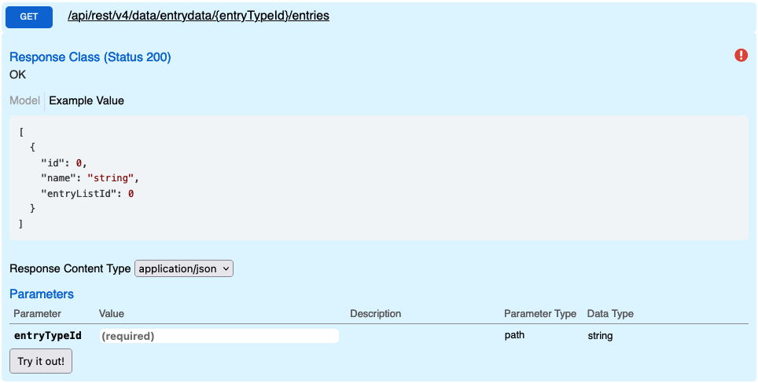

# Entries

Returns all entries for a given entry type, excludes deleted entries. This endpoint is designed for workflows where you need to export all data, and is ideal for processes that you intend to run once. If you only need a subset of the data consider using [Filter](./Filter). If your process depends on deltas consider using [History](./History), its designed for delta workflows and returns both modified and deleted entries.

## Swagger

## Params

| name        | type       | values             |
| ----------- | ---------- | ------------------ |
| entryTypeId | int/string | 2013 / interaction |

## Request

```
GET {{host}}/api/rest/v4/data/entrydata/{{entryTypeId}}/entries HTTP/1.1
```

## Response

```
HTTP/1.1 200 OK
[
  {
    "id": 2772624,
    "name": "Test Interactions",
    "entryListId": 2013
  }
]
```

## Bad Response

```
HTTP/1.1 400 Bad Request
{
  "message": "entryTypeId is not valid"
}
```
