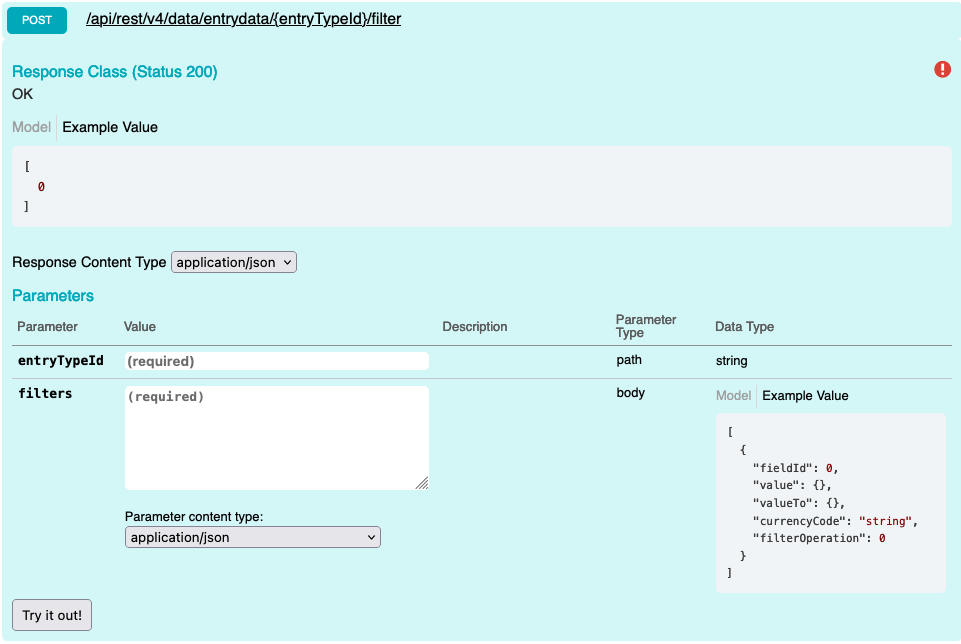

# Filter

Return Ids for filtered entries. It takes an array of filters; all filters are considered And. _This is intended for use with the cells API; for the rows API, you're able to filter using query params_

A full list of filter Operations can be viewed here: [Filter Operations](##filter-operations)

## Swagger



## Params

| name        | Parameter type | Data Type     | values              |
| ----------- | -------------- | ------------- | ------------------- |
| entryTypeId | Path           | int or string | 2013 or interaction |
| filters     | query          | filter        | filterOperations    |

## Request 

### Single Filter

```
POST {{host}}/api/rest/v4/data/entrydata/{{entryTypeId}}/filter HTTP/1.1
Content-Type: application/json
Authorization: {{auth}}

[
  {
    "fieldId": 2300,
    "value": "v",
    "filterOperation": 1
  }
]


```

## Multiple Filters

```
POST {{host}}/api/rest/v4/data/entrydata/{{entryTypeId}}/filter HTTP/1.1
Content-Type: application/json
Authorization: {{auth}}

[
  {
    "fieldId": 2300,
    "value": "v",
    "filterOperation": 1
  },
  {
    "fieldId": 2302,
    "value": [123232,23123],
    "filterOperation": 7
  }
]

```

## Response

```
HTTP/1.1 200 OK
[
  1882492,
  1882494,
  1882498,
  1882500,
  1891705
]
```

** Error Response**

```
HTTP/1.1 400 Bad Request
{
  "message": "Field with Id \"2302\" does not exist"
}
```