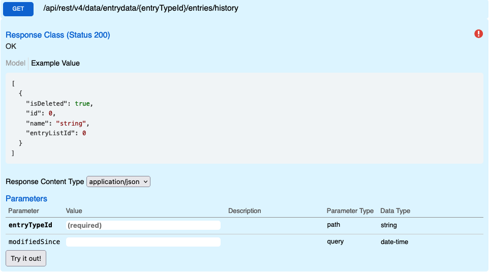

# Modified Data

Returns all modified or deleted entries from a given date-time. The History endpoint is the only endpoint where deleted entries are returned.
## Swagger

## Params

| name          | Parameter type | Data Type     | values                                                                                                                                                                                                                                                                                                                                             |
| ------------- | -------------- | ------------- | -------------------------------------------------------------------------------------------------------------------------------------------------------------------------------------------------------------------------------------------------------------------------------------------------------------------------------------------------- |
| entryTypeId   | Path           | int or string | 2013 or interaction                                                                                                                                                                                                                                                                                                                                |
| modifiedSince | query          | date-time     | any 8601 valid date-time string.**Limited to 6 Months**, if you wish to return all modified entries, make a request without specifying a DateTime. Deleted entries can only be retrieved if deleted within the last 6 months. If a date-time is not specified only modified will be returned, deleted entries will be missing from the result set. |

## Request

**Modified Entries using Entry Type Id**

```
GET {{host}}/api/rest/v4/data/entrydata/2013/entries/history?
modifiedSince=2020-04-26T01:16:40.030Z  HTTP/1.1

```

**Modified Entries using Entry Type apiName**

```
GET {{host}}/api/rest/v4/data/entrydata/interaction/entries/history?
modifiedSince=2020-04-26T01:16:40.030Z  HTTP/1.1

```

## Response

```
HTTP/1.1 200 OK
[
  {
    "isDeleted": false,
    "id": 2772624,
    "name": "Test Interactions",
    "entryListId": 2013
  }
]
```

## Error Responses

```
HTTP/1.1 400 Bad Request
{
  "message": "You cannot request history for more than 180 days. Omit 'modifiedSince' parameter to request history for all time"
}
```

## DateTime Descrepancies
There is a possibility that the entry returned for a given DateTime will have a different value for the system fields `Created Date` and `Modified Date` than the time used to return the entry. Here are some of the scenarios where this may occur.

1. If a entry is modified as part of a bulk action, the system fields capture when the action occured while the history endpoint operates on when this change was committed to the database. Most of the time these values will be there same, but it is possible to have these values drive by several minutes.
2. If a entry was changed via revert changes in the system, the system reverts the `Modified Date` to the previous value, while the history endpoint will retain when the date reversion happened. In this scenario, the history datetime value could be of by an unlimited difference.

When running the integration it is recommed that you use the history endpoint expecially when running Delta queries. Because it captures when data is committed to the database you're guranteed to get all data changes. The DateTime of `modified date` and `modifiedSince` is not guaranteed to be identical because of the two reasons explained above.
