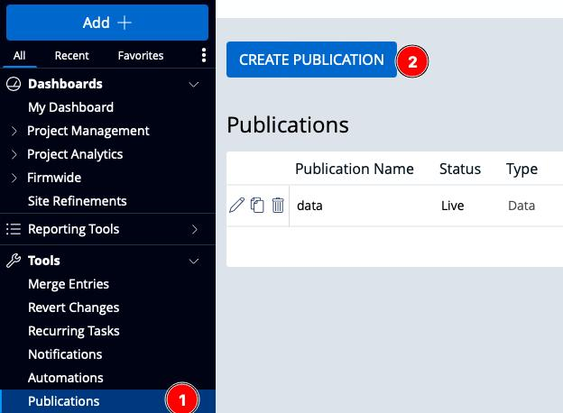

# Publication

The publication APIs provide real-time information for events happening on the site. There are three types of publication events Data, Users, Schema. These types can be configured and named. Named publications are called topics, and you can subscribe to 1 or more topics.

Publications are published immediately and kept for seven days.

## URLs

The publication APIs are centralized and not site-specific. To access the publication APIs for DealCloud sites, use one of the URLs below:

| Location  | SWAGGER                                           |
| --------- | ------------------------------------------------- |
| UAT AE    | https://publications-ae1.dealclouduat.ae/swagger  |
| UAT AP    | https://publications-ap1.dealclouduat.com/swagger |
| UAT EU    | https://publications-eu1.dealclouduat.eu/swagger  |
| UAT US    | https://publications-us1.dealclouduat.com/swagger |
| PROD AE   | https://publications-ae1.dealcloud.ae/swagger     |
| PROD AP   | https://publications-ap1.dealcloud.com/swagger    |
| PROD EU   | https://publications-eu1.dealcloud.eu/swagger     |
| PROD US   | https://publications-us1.dealcloud.com/swagger    |
| PROD US 3 | https://publications-us3.dealcloud.com/swagger    |
| PROD US 4 | https://publications-us4.dealcloud.com/swagger    |
| PROD US 5 | https://publications-us5.dealcloud.com/swagger    |

To access the publication APIs for OnePlace sites, use one of the URLs below:

| Location  | URL                                                          |
| --------- | ------------------------------------------------------------ |
| QA        | https://qa-publications-farm1.oneplaceqa.intapp.com/swagger  |
| QA 2      | https://qa2-publications-farm1.oneplaceqa.intapp.com/swagger |
| SAND AP   | https://publications-sand-ap1.oneplace.intapp.com/swagger    |
| SAND EU   | https://publications-sand-eu1.oneplace.intapp.com/swagger    |
| SAND EU 2 | https://publications-sand-eu2.oneplace.intapp.com/swagger    |
| SAND US   | https://publications-sand-us1.oneplace.intapp.com/swagger    |
| PROD AP   | https://publications-ap1.oneplace.intapp.com/swagger         |
| PROD EU   | https://publications-eu1.oneplace.intapp.com/swagger         |
| PROD EU 2 | https://publications-eu2.oneplace.intapp.com/swagger         |
| PROD US   | https://publications-us1.oneplace.intapp.com/swagger         |

## Enabling Publications

To enable publication, please get in touch with support or your account manager.

## Configuring Publications

You will have a new capability under user management when publication is enabled.



You can create three types of publications data, schema, and user.

When creating a data publication, you can restrict which lists can publish to the given topic. Although, by default, data is published using the Cells schema structure; you can optionally toggle `publish as rows` to generate a JSON structure.

## Making Publication API Requests

Check-List:

1. Publication must be enabled for your site.
2. You should have at least one publication topic configured.
3. Web Services should be enabled for your site.
4. Your user should have access to both web services & publications.

### Tokens

The publication APIs uses the same tokens as all other APIs. While the publication APIs are not site-specific, the token used to access them is the same as other APIs, you must request your site's token endpoint to get a valid access token.

There is a new scope for publication tokens `publish`. You must provide that as the scope when generating a token to consume publications.

**Request**

```
POST {baseUrl}/api/rest/v1/oauth/token
Content-Type: application/x-www-form-urlencoded

scope=publish
&grant_type=client_credentials
&client_id=106
&client_secret=1356GYNU
```

### Topics

Return Names of topics currently being published. _These names can be determined by the user when creating a publication in the Web interface_

**Request**

```
GET {pubUrl}/api/rest/v1/publication/topics
Authorization: {{auth}}
```

**Response**

```
HTTP/1.1 200 OK
...
Content-Type: application/json; charset=utf-8
Connection: close

[
  "users",
  "schema",
  "data",
]
```

### Poll

You can get data from 1 or more topics; if polling for multiple topics, data for each topic will be paged.

A Poll response will always have the topicName, EntityType, and the offset. When multiple items are being polled for, each entity type will be in a separate response.

#### User

User events include the following updates:

1. User Group
   1. Create
   2. Update
   3. Delete
2. User
   1. Create
   2. Update
   3. Delete
3. Proxy User
   1. Created

#### Schema

Schema events include the following updates:

1. EntryList
   1. Create
   2. Update
   3. Delete
2. Field
   1. Create
   2. Update
   3. Delete
      **Request**

```
POST {pubUrl}/{{poll}}
Authorization: {{auth}}
Content-Type: application/json

{
  "Topics": [
  "schema"
],
  "TimeOut": 15000,
  "Count": 0
}
```

#### Data Responses

Data events have some special configurations. You can choose to publish data events as Cells or Rows. You can choose to publish events on all objects or a subset of objects. You can apply filters to each object.

#### Response Error

If a given topic has not had any published events or if the topic name is incorrect, it will produce a 400 error.

```
HTTP/1.1 400 Bad Request
{
  "Message": "One or more topics does not exist in Kafka. Probably no messages has been sent into that topic yet."
}
```

### Acknowledge

Acknowledging a message will set the paging. If you do not acknowledge the message on your next connection, the stored messages will start over. You can use the acknowledge endpoint to increment up or down. When acknowledging you should send the current `offset + 1`. If you simply acknowledge the current offset you will repeat the last message when a new client is created.

**Request**

```
POST {pubUrl}/api/rest/v1/publication/acknowledge
Authorization: {{auth}}
Content-Type: application/json

[
  {
    "Name": "data",
    "Offset": 3
  }
]
```

**Response**

```
HTTP/1.1 200 OK
...
Content-Type: application/json; charset=utf-8
Connection: close
```

## Recommendation / Best Practices

### Number of Topics to Poll against

While you can poll against multiple topics at once it is recommended that you only poll against one topic per poll request.

### What should my timeOut be?

We recommend setting a relatively high timeout (10000 - 15000+).

### What is the function of timeOut?

When the timeout is reached we return a response. A low timeout may get you an empty response even when there are published events, or even malformed JSON values. If there are qualifying events in the queue we will return a response before the timeout is reached. The timeout value sets the maximum time it will take to get your a response.

### How do I use count?

Count is the number of events to return in one request. You should use a relatively low count number unless you are performing large number of updates to the system. A high count value should always be temporary. When there are fewer events then the set count value, the connections remains open until it times out.

### How do timeout and count work together?

Count sets the maximum number of events to return in one request. If there are fewer events in the queue than the count value, the connection will remain open until it times out. If there are more events in the queue than the count value, you will get a response before the timeout.

### How do we build the most responsive system?

It's tempting to make many requests with high count and low timeout. This however will not guarantee you the best performance. To build the most response system where you have events as soon as they're published you actually want to do the opposite, low count high timeout. The best design alternates low count high timeout with high count high timeout. In this design you default to low count, when you receive a response that contains data, you can increase the count until you receive an empty response.

### Recommendation for number of requests.

Keep in mind that most poll requests will return an empty result. The best design is to make a call after your previous call returns. When there are many events your calls will return more frequently and you will make many requests and when there are few events you will make less calls. A design with many calls probably violates the recommendation of how to build the most responsive system above.

## Publication Entity Types

| Entity Type | Description     |
| ----------- | --------------- |
| 1           | Data            |
| 2           | Fields          |
| 3           | EntryLists      |
| 4           | Users           |
| 5           | UserGroups      |
| 6           | UserProxy       |
| 7           | Tenant          |
| 8           | TenantBootstrap |
| 9           | Bootstrap       |
| 10          | Error           |
| 11          | CommonTypes     |
