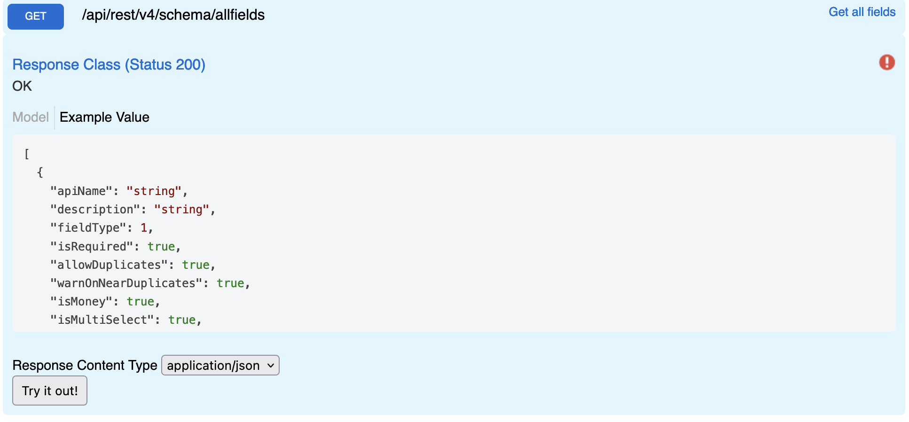

# All Fields

Returns all fields for a given site. **This is a slow operation and should not be used in active integration**. This endpoint is intended for workflows where you need to generate an entire site ERD, Blueprint, or Schema. A much faster operation is to get the fields for a given entry type.

## Swagger


## Params

| name | type | values |
| ---- | ---- | ------ |
| -    | -    | -      |

## Request

```
GET {{host}}/api/rest/v4/schema/allfields
Authorization: {{auth}}
```

## Response

```json
[
  {
    "fieldType": 1,
    "isRequired": true,
    "allowDuplicates": false,
    "warnOnNearDuplicates": false,
    "isMoney": false,
    "isMultiSelect": false,
    "entryLists": [],
    "systemFieldType": 9,
    "isKey": false,
    "isCalculated": false,
    "isAttachment": false,
    "isStoreRequestSupported": true,
    "id": 2038,
    "name": "Name",
    "entryListId": 2000
  },
  {
    "fieldType": 7,
    "isRequired": false,
    "allowDuplicates": true,
    "warnOnNearDuplicates": false,
    "isMoney": false,
    "isMultiSelect": false,
    "entryLists": [
      2032
    ],
    "systemFieldType": 2,
    "isKey": false,
    "isCalculated": false,
    "isAttachment": false,
    "isStoreRequestSupported": false,
    "id": 2035,
    "name": "Created By",
    "entryListId": 2000
  },
  ...
]
```

