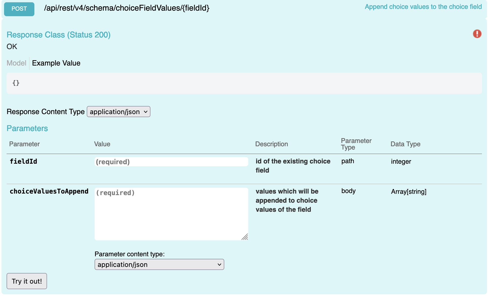

## Choice Field Values

Allows you to append new choice values.
## Swagger

## Params

| name | type | values
|---| --- | --- |
|fieldId | int | 2038|
|choiceValuesToAppend | Array[string]| ["Choice 3", "Choice 4"]|

## Request
```
POST {{host}}/api/rest/v4/schema/choicefieldvalues/{{fieldId}}
Authorization: {{auth}}

[
    "Choice 2",
    "Choice 3"
]
```

## Response

### Error
```
HTTP/1.1 200 OK

```
### Success
```
HTTP/1.1 400 Bad Request
{
  "message": "Field with provided id is not of type Choice: 2204"
}
```
