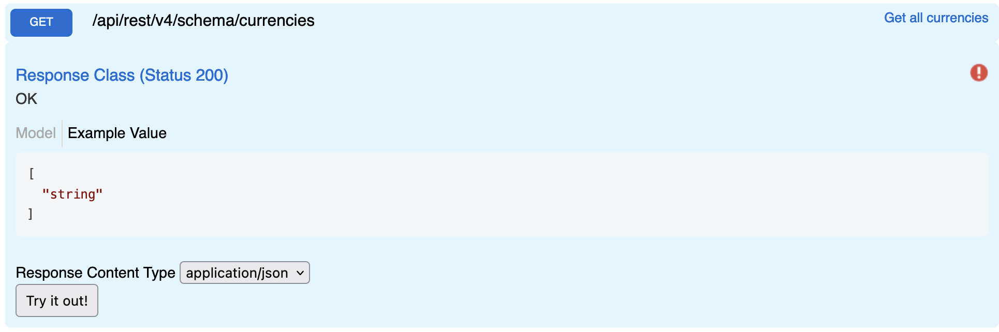

# Currencies

Returns all currencies support by the system.

## Swagger

**Params**

None

**All Currencies**

```
GET {{host}}/api/rest/v4/schema/currencies
Authorization: {{auth}}
```

**Response**

```json
[
  "AED",
  "ARS",
  "AUD",
  "BHD",
  "BRL",
  "BWP",
  "CAD",
  "CHF",
  "CLP",
  "CNY",
  "COP",
  "CRC",
  "CZK",
  "DKK",
  "EGP",
  "ETB",
  "EUR",
  "GBP",
  "GHS",
  "HKD",
  "HRK",
  "HUF",
  "IDR",
  "ILS",
  "INR",
  "IQD",
  "IRR",
  "ISK",
  "JPY",
  "KES",
  "KRW",
  "KWD",
  "KZT",
  "LBP",
  "MAD",
  "MMK",
  "MUR",
  "MXN",
  "MYR",
  "NGN",
  "NOK",
  "NZD",
  "OMR",
  "PHP",
  "PLN",
  "QAR",
  "RON",
  "RSD",
  "RUB",
  "SAR",
  "SEK",
  "SGD",
  "THB",
  "TJS",
  "TND",
  "TRY",
  "TWD",
  "UGX",
  "USD",
  "VND",
  "XAF",
  "XOF",
  "ZAR",
  "ZMW"
]
```
