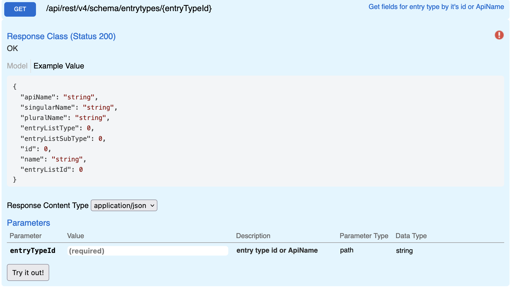

# Entry Type

Returns details for a entry type based on the Id.

## Swagger



## Params

| name | type  | values |
| ---- | ----- | ------ |
| id   | query | int    |

## Request

```
GET {{host}}/api/rest/v4/schema/entryTypes/{{entryTypeId}}
Authorization: {{auth}}
```

## Response

```json
{
  "apiName": "Interaction",
  "singularName": "Interaction",
  "pluralName": "Interactions",
  "entryListType": 4,
  "entryListSubType": 11,
  "id": 2013,
  "name": "Interaction",
  "entryListId": -5
}
```
