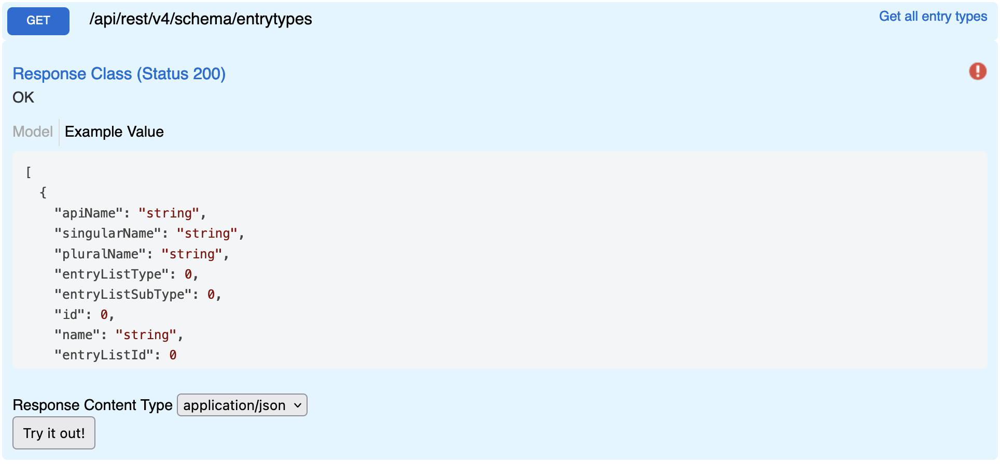

# Entry Types

Returns full list of entry types for a given site.

## Swagger

## Params

| name | type | values
|---| --- | --- |
| - | - | - |

## Request
```
GET {{host}}/api/rest/v4/schema/entrytypes
Authorization: {{auth}}
```

## Response
```json
[
  {
    "apiName": "Attachment",
    "singularName": "Attachment",
    "pluralName": "Attachments",
    "entryListType": 7,
    "entryListSubType": 0,
    "id": 2010,
    "name": "Attachment",
    "entryListId": -5
  },
  {
    "apiName": "CampaignGroup",
    "singularName": "Campaign Group",
    "pluralName": "Campaign Groups",
    "entryListType": 1,
    "entryListSubType": 15,
    "id": 19624,
    "name": "Campaign Group",
    "entryListId": -5
  },
  {
    "apiName": "Campaign",
    "singularName": "Campaign",
    "pluralName": "Campaigns",
    "entryListType": 1,
    "entryListSubType": 14,
    "id": 19633,
    "name": "Campaign",
    "entryListId": -5
  },
  {
    "apiName": "Company",
    "singularName": "Company",
    "pluralName": "Companies",
    "entryListType": 1,
    "entryListSubType": 12,
    "id": 2014,
    "name": "Company",
    "entryListId": -5
  },
  ...
]
```
