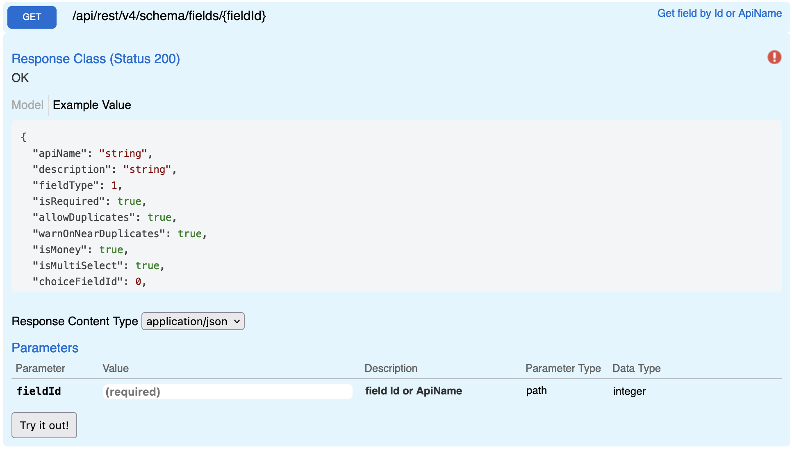

## Field Details

Returns details about a given field. Endpoint will accept only numerical field Id and not apiName for a field since apiName are only unique within the context of a entry type.

## Swagger


## Params

| name    | type | values |
| ------- | ---- | ------ |
| fieldId | int  | 2038   |

## Request

```
GET {{host}}/api/rest/v4/schema/fields/2038
Authorization: {{auth}}
```

## Response

```json
{
  "fieldType": 1,
  "isRequired": true,
  "allowDuplicates": false,
  "warnOnNearDuplicates": false,
  "isMoney": false,
  "isMultiSelect": false,
  "entryLists": [],
  "systemFieldType": 9,
  "isKey": false,
  "isCalculated": false,
  "isAttachment": false,
  "isStoreRequestSupported": true,
  "id": 2038,
  "name": "Name",
  "entryListId": 2000
}
```
