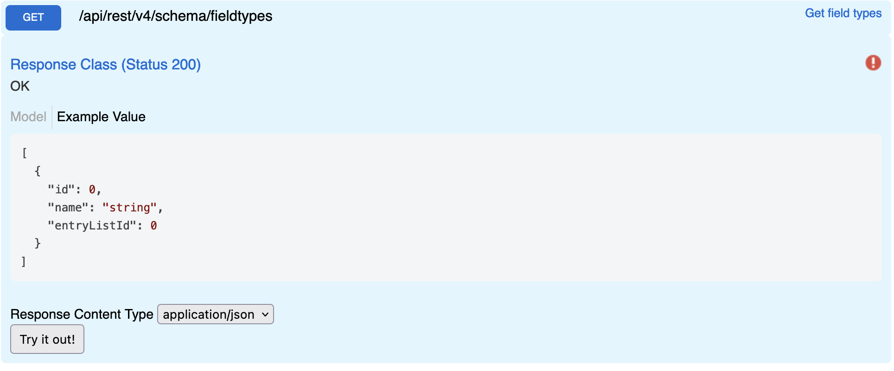

# Field Types

Returns all field types supported by the system. When working with the API you may encounter a collection of these field types. Data are stored in fields with one of these types.

## Swagger

## Params

None

## Request

```
GET {{host}}/api/rest/v4/schema/fieldtypes
Authorization: {{auth}}
```

## Response

```json
[
  {
    "id": 1,
    "name": "Text",
    "entryListId": 0
  },
  {
    "id": 2,
    "name": "Choice",
    "entryListId": 0
  },
  {
    "id": 3,
    "name": "Number",
    "entryListId": 0
  },
  {
    "id": 4,
    "name": "Date",
    "entryListId": 0
  },
  {
    "id": 5,
    "name": "Reference",
    "entryListId": 0
  },
  {
    "id": 6,
    "name": "Boolean",
    "entryListId": 0
  },
  {
    "id": 7,
    "name": "User",
    "entryListId": 0
  },
  {
    "id": 13,
    "name": "Binary",
    "entryListId": 0
  },
  {
    "id": 14,
    "name": "EntryListId",
    "entryListId": 0
  },
  {
    "id": 15,
    "name": "Counter",
    "entryListId": 0
  },
  {
    "id": 16,
    "name": "Image",
    "entryListId": 0
  },
  {
    "id": 17,
    "name": "DataSource",
    "entryListId": 0
  },
  {
    "id": 18,
    "name": "Currency",
    "entryListId": 0
  }
]
```