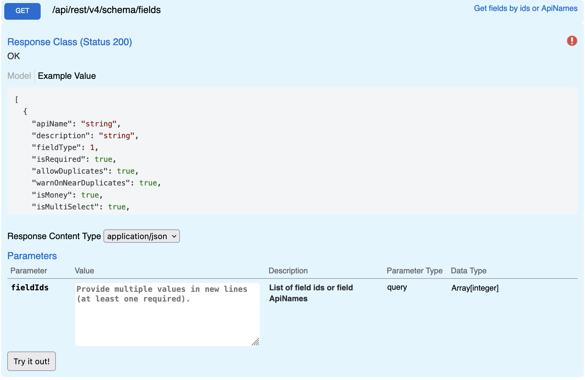

## Fields

Returns descriptive details for specified fields. Accepts only numerical field Ids not apiName. ApiNames are only unique in the context of a entry type.

## Swagger

## Params

| name     | type       | values       |
| -------- | ---------- | ------------ |
| fieldIds | Array[int] | [2038, 1234] |

## Request

```
GET {{host}}/api/rest/v4/schema/fields?fieldIds=2038&fieldIds=2035
```

**Response**

```json
[
  {
    "fieldType": 1,
    "isRequired": true,
    "allowDuplicates": false,
    "warnOnNearDuplicates": false,
    "isMoney": false,
    "isMultiSelect": false,
    "entryLists": [],
    "systemFieldType": 9,
    "isKey": false,
    "isCalculated": false,
    "isAttachment": false,
    "isStoreRequestSupported": true,
    "id": 2038,
    "name": "Name",
    "entryListId": 2000
  },
  {
    "fieldType": 7,
    "isRequired": false,
    "allowDuplicates": true,
    "warnOnNearDuplicates": false,
    "isMoney": false,
    "isMultiSelect": false,
    "entryLists": [2032],
    "systemFieldType": 2,
    "isKey": false,
    "isCalculated": false,
    "isAttachment": false,
    "isStoreRequestSupported": false,
    "id": 2035,
    "name": "Created By",
    "entryListId": 2000
  }
]
```
