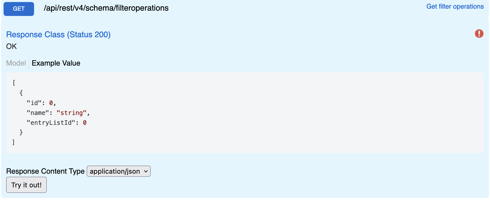

# Filter Operations

Returns all filter operations supported by the Data APIs.

## Swagger

## Params

| name | type | values
|:-----:| :-----: | :-----: |
| - | - | - |

## Request
```http
GET {{host}}/api/rest/v4/schema/filteroperations
Authorization: {{auth}}
```

## Response
```json
[
  {
    "id": 0,
    "name": "Equals",
    "entryListId": 0
  },
  {
    "id": 1,
    "name": "Contains",
    "entryListId": 0
  },
  {
    "id": 2,
    "name": "Greater",
    "entryListId": 0
  },
  {
    "id": 3,
    "name": "GreaterOrEqual",
    "entryListId": 0
  },
  {
    "id": 4,
    "name": "Less",
    "entryListId": 0
  },
  {
    "id": 5,
    "name": "LessOrEqual",
    "entryListId": 0
  },
  {
    "id": 6,
    "name": "StartsWith",
    "entryListId": 0
  },
  {
    "id": 7,
    "name": "In",
    "entryListId": 0
  },
  {
    "id": 8,
    "name": "Between",
    "entryListId": 0
  },
  {
    "id": 9,
    "name": "NotIn",
    "entryListId": 0
  },
  {
    "id": 10,
    "name": "NotEqualTo",
    "entryListId": 0
  },
  {
    "id": 11,
    "name": "DoesntContain",
    "entryListId": 0
  },
  {
    "id": 12,
    "name": "NoData",
    "entryListId": 0
  },
  {
    "id": 13,
    "name": "NotNoData",
    "entryListId": 0
  }
]
```

**Models**
*Schema FieldTypes*

**FilterOperations To Queries**
The filter operations are intended for the Cells API, the rows API support most of the filterOperations below are the conversions and exact syntax.

| Id | Name    | Description      | Cells API  | Rows API| 
|:---| :-----: | :--------------: | :---------:| :----: |
| 0 | Equals | Exact Value | 0 | $eq |
| 1 | Contains | String search | 1 | $contains |
| 2 | Greater | Number or Date comparison | 2 | $gt |
| 3 | GreaterOrEqual | Number or Date comparison | 3 | $gte |
| 4 | Less | Number or Date comparison | 4 | $lt | 
| 5 | LessOrEquals | Number or Date comparison | 5 | $lte |
| 6 | StartsWith | String Comparison | 6 | $startswith |
| 7 | In | Array comparison of ID | 7 | $in |
| 8 | Between | Number or Date comparison | 8 | $between |
| 9 | NotIn | Value is not in an array of values | 9 | $nin |
| 10 | NotEqualTo | Value is not equal to x | 10 | $not |
| 11 | DoesntContain | String comparison for missing value | 11 | - |
| 12 | NoData | Value is null | 12 | - |
| 13 | NotNoData | Value is not null | 13 | - |
| 14 | EndsWith | String Comparision | - | $endswith |
| 15 | Or | either or comparison | - | $or |
| 16 | And | - | - | $and |
Table: Filters for Rows and Cells

### Equals
<table>
<thead>
  <tr>
    <th> Cells </th><th> Rows </th>
  </tr>
  <tr>
</thead>
</tbody>
  <tr>
    <td>
<pre>
[
  {
    "fieldId": 2300,
    "value": "bob",
    "filterOperation": 0
  }
]
</pre>
    </td>
    <td>
<pre>

short hand
?query={'name':'bob'}

standard
?query={'name':{'$eq':'bob'}}

</pre>
    </td>
  </tr>
  </tbody>
</table>

**Cells**
```
[
  {
    "fieldId": 2300,
    "value": "bob",
    "filterOperation": 0
  }
]
```
**Rows**
```
short hand
?query={'name':'bob'}

standard
?query={'name':{'$eq':'bob'}}
```
### Contains
<table>
  <thead>
    <tr>
      <th> Cells </th><th> Rows </th>
    </tr>
  </thead>
  </tbody>
    <tr>
      <td>
<pre>
[
  {
    "fieldId": 2300,
    "value": "b",
    "filterOperation": 1
  }
]
</pre>
    </td>
    <td>
<pre>
?query={'name':{'$contains':'b'}}
</pre>
      </td>
    </tr>
  </tbody>
</table>

**Cells**
```
[
  {
    "fieldId": 2300,
    "value": "b",
    "filterOperation": 1
  }
]
```
**Rows**
```
?query={'name':{'$contains':'b'}}
```
### Greater
<table>
  <thead>
  <tr>
    <th> Cells </th><th> Rows </th>
  </tr>
  </thead>
</tbody>
  <tr>
    <td>
<pre>
[
  {
    "fieldId": 2301,
    "value": 2500,
    "filterOperation": 2
  }
]
</pre>
    </td>
    <td>
<pre>
?query={'revenue':{'$gt':2500}}
</pre>
    </td>
  </tr>
  </tbody>
</table>

**Cells**
```
[
  {
    "fieldId": 2301,
    "value": 2500,
    "filterOperation": 2
  }
]
```
**Rows**
```
?query={'revenue':{'$gt':2500}}
```
### Greater Or Equal
<table>
<thead>
  <tr>
    <th> Cells </th><th> Rows </th>
  </tr>
  </thead>
</tbody>
  <tr>
    <td>
<pre>
[
  {
    "fieldId": 2301,
    "value": 2500,
    "filterOperation": 3
  }
]
</pre>
    </td>
    <td>
<pre>
?query={'revenue':{'$gte':2500}}
</pre>
    </td>
  </tr>
  </tbody>
</table>

**Cells**
```
[
  {
    "fieldId": 2301,
    "value": 2500,
    "filterOperation": 3
  }
]
```
**Rows**
```
?query={'revenue':{'$gte':2500}}
```
### Less
<table>
<thead>
  <tr>
    <th> Cells </th><th> Rows </th>
  </tr>
  </thead>
</tbody>
  <tr>
    <td>
<pre>
[
  {
    "fieldId": 2301,
    "value": 2500,
    "filterOperation": 4
  }
]
</pre>
    </td>
    <td>
<pre>
?query={'revenue':{'$lt':2500}}
</pre>
    </td>
  </tr>
  </tbody>
</table>

**Cells**
```
[
  {
    "fieldId": 2301,
    "value": 2500,
    "filterOperation": 4
  }
]
```
**Rows**
```
?query={'revenue':{'$lt':2500}}
```
### Less Or Equals
<table>
<thead>
  <tr>
    <th> Cells </th><th> Rows </th>
  </tr>
  </thead>
<tbody>
  <tr>
    <td>
<pre>
[
  {
    "fieldId": 2301,
    "value": 2500,
    "filterOperation": 5
  }
]
</pre>
    </td>
    <td>
<pre>
?query={'revenue':{'$lte':2500}}
</pre>
    </td>
  </tr>
  </tbody>
</table>

**Cells**
```
[
  {
    "fieldId": 2301,
    "value": 2500,
    "filterOperation": 5
  }
]
```
**Rows**
```
?query={'revenue':{'$lte':2500}}
```

### Starts With
<table>
  <thead>
    <tr>
      <th> Cells </th><th> Rows </th>
    </tr>
  </thead>
  <tbody>
  <tr>
    <td>
<pre>
[
  {
    "fieldId": 2300,
    "value": "b",
    "filterOperation": 6
  }
]
</pre>
    </td>
    <td>
<pre>
?query={'name':{'$startswith':'b'}}
</pre>
    </td>
  </tr>
  </tbody>
</table>

**Cells**
```
[
  {
    "fieldId": 2300,
    "value": "b",
    "filterOperation": 6
  }
]
```
**Rows**
```
?query={'name':{'$startswith':'b'}}
```
### In
<table>
  <thead>
  <tr>
    <th> Cells </th><th> Rows </th>
  </thead>
<tbody>
  <tr>
    <td>
<pre>
[
  {
    "fieldId": 2300,
    "value": [123,122,2123],
    "filterOperation": 7
  }
]
</pre>
    </td>
    <td>
<pre>
?query={'street':{'$in':["apple','microsoft']}}
</pre>
    </td>
  </tr>
  </tbody>
</table>

**Cells**
```
[
  {
    "fieldId": 2300,
    "value": [123,122,2123],
    "filterOperation": 7
  }
]
```
**Rows**
```
?query={'street':{'$in':["apple','microsoft']}}
```

### Between
<table>
<thead>
  <tr>
    <th> Cells </th><th> Rows </th>
  </tr>
  </thead>
  <tbody>
  <tr>
    <td>
<pre>
Number
[
  {
    "fieldId": 2300,
    "value": 10,
    "ValueTo": 20,
    "filterOperation": 8
  }
]
Dates
[
  {
    "fieldId": 2300,
    "value": "2020-01-01",
    "ValueTo": "2021-01-01",
    "filterOperation": 9
  }
]
</pre>
    </td>
    <td>
<pre>
Number
?query={'revenue':{'$between':[10,20]}}

Dates (Dates are rounded to the nearest Date)
?query={'revenue':{'$between':[10,20]}}
</pre>
    </td>
  </tr>
  </tbody>
</table>

**Cells**
```
Number
[
  {
    "fieldId": 2300,
    "value": 10,
    "ValueTo": 20,
    "filterOperation": 8
  }
]
Dates
[
  {
    "fieldId": 2300,
    "value": "2020-01-01",
    "ValueTo": "2021-01-01",
    "filterOperation": 9
  }
]
```
**Rows**
```
Number
?query={'revenue':{'$between':[10,20]}}

Dates (Dates are rounded to the nearest Date)
?query={'revenue':{'$between':[10,20]}}
```

### Not In
<table>
  <tr>
    <th> Cells </th><th> Rows </th>
  </tr>
  <tr>
    <td>
<pre>
[
  {
    "fieldId": 2300,
    "value": [12,123,1234],
    "filterOperation": 9
  }
]
</pre>
    </td>
    <td>
<pre>
Names
?query={'name':{'$notin':["bob","fred"]}}

Ids
?query={'name':{'$notin':[10,20]}}
</pre>
    </td>
  </tr>
</table>

**Cells**
```
[
  {
    "fieldId": 2300,
    "value": [12,123,1234],
    "filterOperation": 9
  }
]
```
**Rows**
```
Names
?query={'name':{'$notin':["bob","fred"]}}

Ids
?query={'name':{'$notin':[10,20]}}
```

### Not Equal To
<table>
  <tr>
    <th> Cells </th><th> Rows </th>
  </tr>
  <tr>
    <td>
<pre>
Number, Id
[
  {
    "fieldId": 2300,
    "value": 12,
    "filterOperation": 10
  }
]
String
[
  {
    "fieldId": 2300,
    "value": "hello",
    "filterOperation": 10
  }
]
</pre>
    </td>
    <td>
<pre>
Names
?query={'name':{'$not':"bob"}}

Ids
?query={'name':{'$not':10}}
</pre>
    </td>
  </tr>
</table>

**Cells**
```
Number, Id
[
  {
    "fieldId": 2300,
    "value": 12,
    "filterOperation": 10
  }
]
String
[
  {
    "fieldId": 2300,
    "value": "hello",
    "filterOperation": 10
  }
]
```
**Rows**
```
Names
?query={'name':{'$not':"bob"}}

Ids
?query={'name':{'$not':10}}
```
### Does Not Contain
<table>
  <tr>
    <th> Cells </th><th> Rows </th>
  </tr>
  <tr>
    <td>
<pre>
Id
[
  {
    "fieldId": 2300,
    "value": [12,13,14],
    "filterOperation": 11
  }
]
String
[
  {
    "fieldId": 2300,
    "value": "pple",
    "filterOperation": 11
  }
]
</pre>
    </td>
    <td>
No Exact match but can get the same output with:
<pre>
Single
?query={'company':{'$nin':{'$contain':'apple'}}}
Multiple
?query={'company':{'$nin':{'$or:[{'$contain':['apple'}, {'$contain':'peach']}}}
</pre>
    </td>
  </tr>
</table>

**Cells**
```
Id
[
  {
    "fieldId": 2300,
    "value": [12,13,14],
    "filterOperation": 11
  }
]
String
[
  {
    "fieldId": 2300,
    "value": "pple",
    "filterOperation": 11
  }
]
```
**Rows**
```
Single
?query={'company':{'$nin':{'$contain':'apple'}}}
Multiple
?query={'company':{'$nin':{'$or:[{'$contain':['apple'}, {'$contain':'peach']}}}
```
### No Data
<table>
  <tr>
    <th> Cells </th><th> Rows </th>
  </tr>
  <tr>
    <td>
<pre>
[
  {
    "fieldId": 2300,
    "filterOperation": 12
  }
]
</pre>
    </td>
    <td>
<pre>
Short
?query={'company': ''}
Standard
?query={'company':{'$eq':''}}}
</pre>
    </td>
  </tr>
</table>

**Cells**
```
[
  {
    "fieldId": 2300,
    "filterOperation": 12
  }
]
```
**Rows**
```
Short
?query={'company': ''}
Standard
?query={'company':{'$eq':''}}}
```
### Not No Data
<table>
  <tr>
    <th> Cells </th><th> Rows </th>
  </tr>
  <tr>
    <td>
<pre>
[
  {
    "fieldId": 2300,
    "filterOperation": 13
  }
]
</pre>
    </td>
    <td>
<pre>
?query={'company':{'$not':''}}}
</pre>
    </td>
  </tr>
</table>

**Cells**
```
[
  {
    "fieldId": 2300,
    "filterOperation": 13
  }
]
```
**Rows**
```
?query={'company':{'$not':''}}}
```
### Ends With
<table>
  <tr>
    <th> Cells </th><th> Rows </th>
  </tr>
  <tr>
    <td>
<pre>
N/A
</pre>
    </td>
    <td>
<pre>
?query={'company':{'$endswith':'le'}}
</pre>
    </td>
  </tr>
</table>

**Cells**
```
N/A
```
**Rows**
```
?query={'company':{'$endswith':'le'}}
```
### OR
<table>
  <tr>
    <th> Cells </th><th> Rows </th>
  </tr>
  <tr>
    <td>
<pre>
N/A
Filter multiple times
</pre>
    </td>
    <td>
<pre>
?query={'$or':[{'status':'started'},{'status':'complete'}]}
</pre>
    </td>
  </tr>
</table>

**Cells**
```
N/A
Filter multiple times
```
**Rows**
```
?query={'$or':[{'status':'started'},{'status':'complete'}]}
```
### AND
<table>
  <tr>
    <th> Cells </th><th> Rows </th>
  </tr>
  <tr>
    <td>
<pre>
[
  {
    "fieldId": 2300,
    "filterOperation": 13
  },
  {
    "fieldId": 2300,
    "value": "pple",
    "filterOperation": 11
  }
]
</pre>
    </td>
    <td>
<pre>
?query={'$and':[{'status':'started'},{'value':{'gte':10000}}]}
</pre>
    </td>
  </tr>
</table>

**Cells**
```
[
  {
    "fieldId": 2300,
    "filterOperation": 13
  },
  {
    "fieldId": 2300,
    "value": "pple",
    "filterOperation": 11
  }
]
```
**Rows**
```
?query={'$and':[{'status':'started'},{'value':{'gte':10000}}]}
```