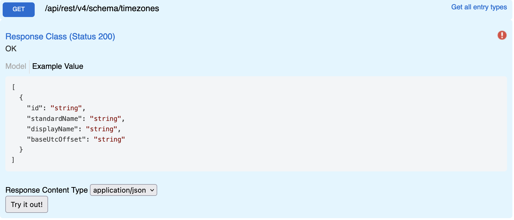

## Timezone Values

Returns time zone unique identifiers.

## Swagger


## Params

None

## Request

```
GET {{host}}/api/rest/v4/schema/timezones
Authorization: {{auth}}
```

## Response

```
HTTP/1.1 200 OK
[
  {
    "id": "Dateline Standard Time",
    "standardName": "Dateline Standard Time",
    "displayName": "(UTC-12:00) International Date Line West",
    "baseUtcOffset": "-12:00:00"
  },
  {
    "id": "UTC-11",
    "standardName": "UTC-11",
    "displayName": "(UTC-11:00) Coordinated Universal Time-11",
    "baseUtcOffset": "-11:00:00"
  },
  {
    "id": "Aleutian Standard Time",
    "standardName": "Aleutian Standard Time",
    "displayName": "(UTC-10:00) Aleutian Islands",
    "baseUtcOffset": "-10:00:00"
  },
  ...
]
```
