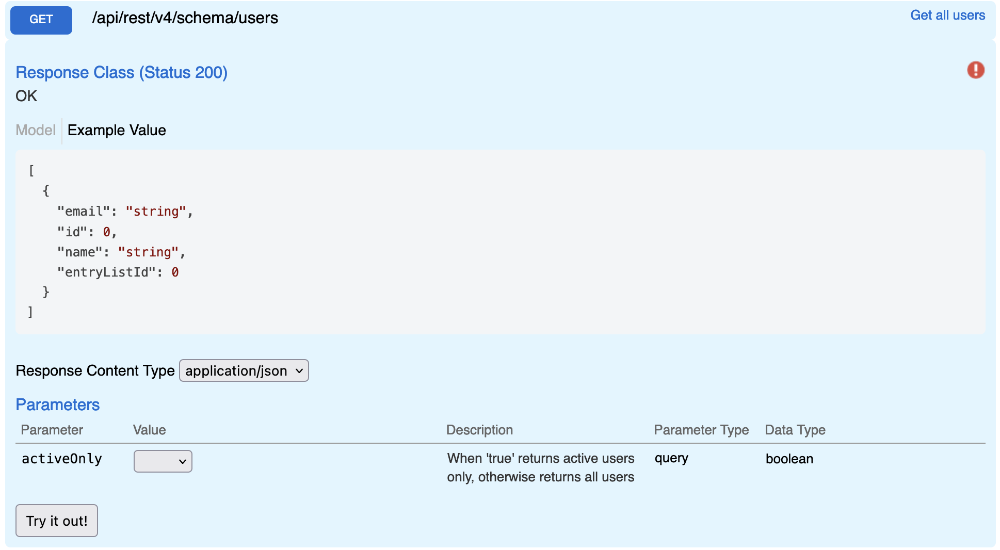

# Users

Returns users or active users. Useful when you need to update/modify a user reference field.

## Swagger



## Params

| name       | type    | values       |
| ---------- | ------- | ------------ |
| activeOnly | boolean | true / false |

## Request

**Active User**

```
GET {{host}}/api/rest/v4/schema/users
    ?activeOnly=true
Authorization: {{auth}}
```

**All Users**

```
GET {{host}}/api/rest/v4/schema/users
Authorization: {{auth}}
```

## Response

```json
[
  {
    "email": "abc@123.com",
    "id": 1026,
    "name": "Firstname Lastname",
    "entryListId": -1
  },
  {
    "email": "def@123.com",
    "id": 1044,
    "name": "Firstname Lastname",
    "entryListId": -1
  },
  {
    "email": "ghi@123.com",
    "id": 1048,
    "name": "Firstname Lastname",
    "entryListId": -1
  }
]
```